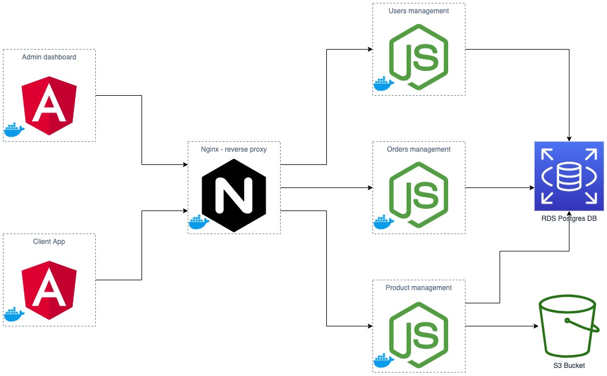

# Ecommerce microservices

This is a simple cloud application developed alongside the Udacity Cloud Engineering Nanodegree.

### Users type :
There are two type of users: admin, & client.

### Use cases :
It allows:
* Admins: to login, list the products, create & delete a product. List the client orders, and accept or reject an order.
* Client: to check the products, and order a product.

# Global architecture 



### Create Docker Images and run it locally
* Build the images:
```
docker-compose -f docker-compose-build.yaml build --parallel
```
* Starting the app as a container on a local system:
```
docker-compose up
```
PS: I could not share the images on Docker Hub because of my slow internet.
In order to deploy the application to to a Kubernetes cluster, we can fellow the steps mentioned here : [yahiakr/Udagram_microservices](https://github.com/yahiakr/Udagram_microservices).

# Other informations:
*	You can test the services using postman collections. (each service has it's own postman collection in it's root folder).
*	postman collections contain tests.
* To login to the dashboard use the following credentials : email: admin@gmail.com, password: admin.
PS: I didn't add the sign-up, because in a real world scenario, only the admin can add other admins. But to test it, you can create an account using postman request (in users/postman-collection).
* A client can order a product by adding his email. (no address or payment method, just for simplicity, because it's not the objectif of the project).