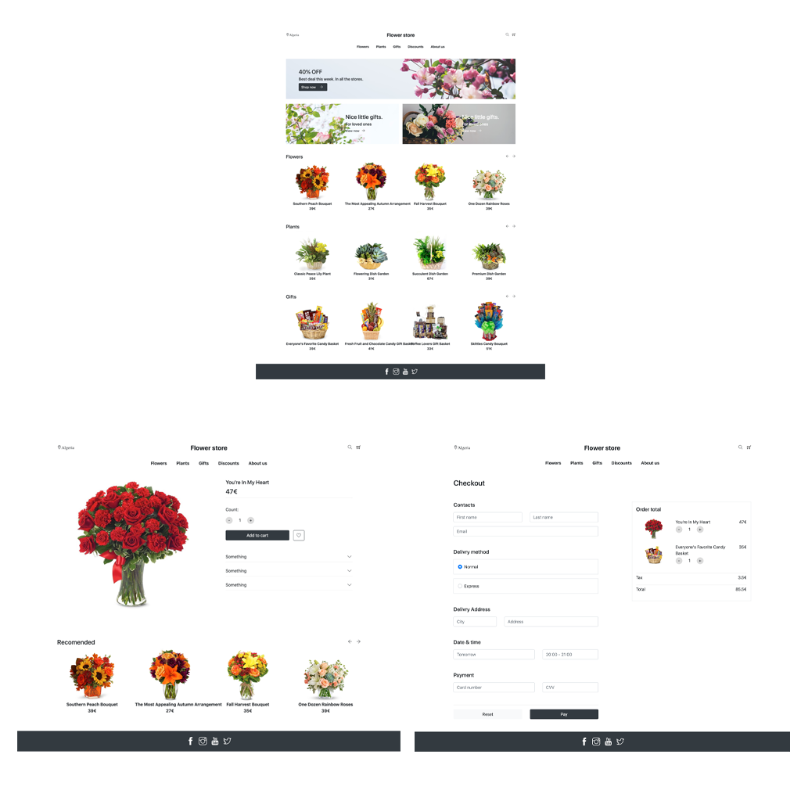
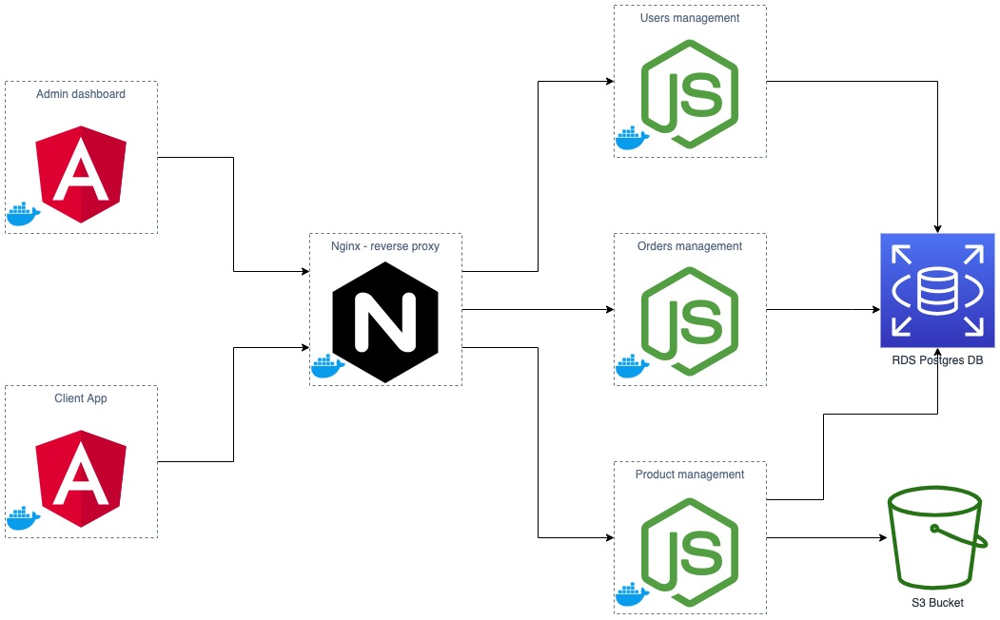

# Ecommerce microservices



This is a simple cloud application developed alongside the Udacity Cloud Engineering Nanodegree.

**Users type :** There are two types of users: admin, & client.

**Use cases :** It allows:
* Admins: to login, list the products, create & delete a product. List the client orders, and accept or reject an order.
* Client: to check the products, and order a product.

# Global architecture 



### Create Docker Images and run it locally
* Build the images:
```
docker-compose -f docker-compose-build.yaml build --parallel
```
* Starting the app as a container on a local system:
```
docker-compose up
```
* to share those images through the Docker Hub:
```
docker-compose -f docker-compose-build.yaml push
```
PS: I could not share the images on Docker Hub because of my slow internet.
I only shared the [yahiakr/ecommerce-reverseproxy](https://hub.docker.com/r/yahiakr/ecommerce-reverseproxy) image because it's lightweight.

### Deploy the application to to a kubernetes cluster

1. First we create the infrastructure (kubernetes cluster) using the AWS management console, [This article](https://medium.com/faun/create-your-first-application-on-aws-eks-kubernetes-cluster-874ee9681293) guides you to set up your Kubernetes cluster in AWS EKS.

2. Setup the credentials & secrets:
```
kubectl apply -f env-configmap.yaml
kubectl apply -f aws-secret.yaml
kubectl apply -f env-secret.yaml
```

3. Launch the deployments and the services in your Kubernetes cluster as follows:
```
kubectl apply -f users-microservice-deployment.yaml
kubectl apply -f products-microservice-deployment.yaml
kubectl apply -f orders-microservice-deployment.yaml
kubectl apply -f admin-frontend-deployment.yaml
kubectl apply -f client-frontend-deployment.yaml
kubectl apply -f reverseproxy-deployment.yaml

#Launch the services
kubectl apply -f users-microservice-service.yaml
kubectl apply -f products-microservice-service.yaml
kubectl apply -f orders-microservice-service.yaml
kubectl apply -f admin-frontend-service.yaml
kubectl apply -f client-frontend-service.yaml
kubectl apply -f reverseproxy-service.yaml
```

# Other informations:
* You can acces the dashboard from : [http://localhost:8100/](http://localhost:8100/), & the client app from: [http://localhost:8000/](http://localhost:8000/).
*	You can test the services using postman collections. (each service has it's own postman collection in it's root folder).
*	postman collections contain tests.
* To login to the dashboard use the following credentials : email: admin@gmail.com, password: admin.
PS: I didn't add the sign-up, because in a real world scenario, only the admin can add other admins. But to test it, you can create an account using postman request (in users/postman-collection).
* A client can order a product by adding his email. (no address or payment method, just for simplicity, because it's not the objectif of the project).
